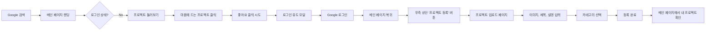
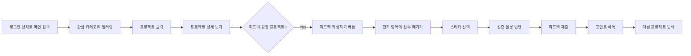
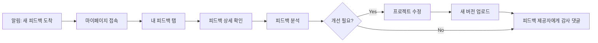

# 바이브폴리오 프로젝트 종합 점검 보고서

> **작성일**: 2026년 2월 12일
> **점검 범위**: UX/UI, 디자인, 사용자 프로세스, 기술 아키텍처, 관리자 페이지
> **참조 문서**: [OKR.md](OKR.md)

---

## 📋 목차

1. [관리자 페이지 접근 문제 진단](#1-관리자-페이지-접근-문제-진단)
2. [전체 프로젝트 구조 분석](#2-전체-프로젝트-구조-분석)
3. [UX/UI 디자인 점검](#3-uxui-디자인-점검)
4. [사용자 프로세스 분석](#4-사용자-프로세스-분석)
5. [개선 계획 및 우선순위](#5-개선-계획-및-우선순위)

---

## 1. 관리자 페이지 접근 문제 진단

### 🔍 문제 현황

**vibefolio.net에서 관리자 페이지 접근이 안 되는 문제**

### 📊 기술적 분석

#### 현재 관리자 인증 흐름

1. **[admins.ts:1-31](src/lib/auth/admins.ts#L1-L31)** - 관리자 이메일 화이트리스트 관리

   ```typescript
   export const ADMIN_EMAILS = [
     "juuuno@naver.com",
     "juuuno1116@gmail.com",
     "designd@designd.co.kr",
     "designdlab@designdlab.co.kr",
     "admin@vibefolio.net",
     "duscontactus@gmail.com",
   ];
   ```

2. **[AuthContext.tsx:189-197](src/lib/auth/AuthContext.tsx#L189-L197)** - 관리자 권한 체크

   ```typescript
   const isAdminUser = React.useMemo(() => {
     const isMatched = isAdminEmail(user) || userProfile?.role === "admin";
     return isMatched;
   }, [user?.email, userProfile?.role]);
   ```

3. **[AdminGuard.tsx:9-91](src/components/admin/AdminGuard.tsx#L9-L91)** - 접근 제어
   - `useAdmin` 훅으로 1차 권한 체크
   - fallback으로 Supabase에서 직접 사용자 정보 재확인
   - 접근 거부 시 명확한 UI 표시

4. **[Header.tsx:268-272](src/components/Header.tsx#L268-L272)** - 관리자 센터 버튼
   ```typescript
   {isAdmin && (
     <button onClick={() => { console.log('Admin Center Clicked'); router.push('/admin'); }}>
       관리자 센터
     </button>
   )}
   ```

### ⚠️ 잠재적 문제점

#### 1. **이메일 대소문자 일치 문제**

- `isAdminEmail()` 함수에서 `.toLowerCase()` 처리를 하고 있음
- 하지만 ADMIN_EMAILS 배열 자체가 소문자가 아닐 수 있음
- **해결 방법**: ADMIN_EMAILS를 모두 소문자로 통일

```typescript
// 현재 코드 (문제 가능성)
export const ADMIN_EMAILS = [
  "juuuno@naver.com", // 소문자
  "designd@designd.co.kr", // 소문자
];

// 사용자 이메일이 "Juuuno@naver.com"으로 저장되어 있다면?
// toLowerCase() 처리해도 배열 비교 시 문제 발생 가능
```

#### 2. **Supabase User Metadata vs DB Profiles 불일치**

- AuthContext는 `user.email`과 `userProfile.role` 두 가지를 체크
- DB의 `profiles` 테이블에 role이 제대로 설정되지 않았을 가능성
- Google OAuth 로그인 시 메타데이터만 있고 DB에 role이 없을 수 있음

#### 3. **프로덕션 환경 특수성**

- 로컬 개발 환경에서는 잘 작동할 수 있음
- 프로덕션에서만 발생하는 문제:
  - Supabase RLS(Row Level Security) 정책
  - 환경변수 설정 차이
  - CORS 정책

#### 4. **디버그 로그 과다**

- 최근 커밋에서 디버그 로그를 많이 추가한 것으로 보임
- 프로덕션 배포 전 디버그 로그 제거 필요

### ✅ 해결 방안

#### 즉시 조치 (High Priority)

1. **ADMIN_EMAILS 소문자 통일**

   ```typescript
   export const ADMIN_EMAILS = [
     "juuuno@naver.com",
     "juuuno1116@gmail.com",
     "designd@designd.co.kr",
     "designdlab@designdlab.co.kr",
     "admin@vibefolio.net",
     "duscontactus@gmail.com",
   ].map((email) => email.toLowerCase()); // 모든 이메일을 소문자로 변환
   ```

2. **DB profiles 테이블 role 확인**
   - Supabase 대시보드에서 관리자 계정의 role이 "admin"으로 설정되어 있는지 확인
   - SQL 쿼리로 확인:

     ```sql
     SELECT id, email, role FROM auth.users
     WHERE email IN ('juuuno@naver.com', 'juuuno1116@gmail.com');

     SELECT id, username, role FROM public.profiles
     WHERE id IN (SELECT id FROM auth.users WHERE email IN (...));
     ```

3. **브라우저 콘솔 로그 확인**
   - vibefolio.net에서 F12 개발자 도구 열기
   - Console 탭에서 `[AdminCheck]`, `[AdminGuard]`, `[Auth]` 로그 확인
   - 어느 단계에서 권한이 거부되는지 파악

#### 중기 조치 (Medium Priority)

4. **관리자 권한 체크 로직 강화**

   ```typescript
   // src/lib/auth/admins.ts에 추가
   export const isAdminEmail = (userOrEmail?: any): boolean => {
     if (!userOrEmail) {
       console.warn("[AdminCheck] No user/email provided");
       return false;
     }

     const email =
       typeof userOrEmail === "string"
         ? userOrEmail
         : userOrEmail.email || userOrEmail.user_metadata?.email;

     if (!email) {
       console.warn("[AdminCheck] No email found", userOrEmail);
       return false;
     }

     const normalizedEmail = email.toLowerCase().trim();
     const isAdmin = ADMIN_EMAILS.includes(normalizedEmail);

     console.log(`[AdminCheck] ${email} -> ${isAdmin ? "ADMIN" : "USER"}`);
     return isAdmin;
   };
   ```

5. **환경변수 확인**
   - `.env.local`과 Vercel/프로덕션 환경변수 비교
   - Supabase URL, Anon Key가 정확한지 확인

6. **디버그 로그 정리**
   - 프로덕션에서는 `console.log` 대신 `console.error`만 사용
   - 또는 환경변수로 디버그 모드 제어

---

## 2. 전체 프로젝트 구조 분석

### 📂 기술 스택

- **프레임워크**: Next.js 14.1.3 (App Router)
- **언어**: TypeScript 5
- **스타일링**: Tailwind CSS 3.4.1
- **UI 라이브러리**: Radix UI, shadcn/ui
- **백엔드**: Supabase (Auth, Database, Storage, Realtime)
- **에디터**: Tiptap
- **애니메이션**: Framer Motion
- **상태 관리**: React Context API, React Query

### 🗺️ 라우팅 구조 (총 60+ 페이지)

#### 핵심 페이지

| 경로                | 목적                   | 우선순위 | OKR 연관      |
| ------------------- | ---------------------- | -------- | ------------- |
| `/`                 | 메인 페이지 (발견하기) | ⭐⭐⭐   | KR1, KR2, KR3 |
| `/signup`, `/login` | 회원가입/로그인        | ⭐⭐⭐   | KR1           |
| `/project/upload`   | 프로젝트 업로드        | ⭐⭐⭐   | KR2           |
| `/project/[id]`     | 프로젝트 상세          | ⭐⭐⭐   | KR2, KR3      |
| `/mypage`           | 마이페이지             | ⭐⭐     | KR3           |
| `/growth`           | 성장하기 (피드백)      | ⭐⭐     | KR2           |
| `/recruit`          | 연결하기 (채용)        | ⭐⭐     | -             |
| `/admin`            | 관리자 대시보드        | ⭐       | -             |

#### 보조 페이지

- `/about`, `/faq`, `/contact` - 정보성 페이지
- `/policy/terms`, `/policy/privacy` - 법적 문서
- `/tools/*` - AI 도구 (Lean Canvas, Persona 등)
- `/[username]` - 사용자 프로필 페이지
- `/creator/[username]` - 창작자 페이지

### 🏗️ 컴포넌트 구조

```
src/
├── app/                    # Next.js App Router 페이지
│   ├── (auth)/            # 인증 관련 페이지
│   ├── admin/             # 관리자 페이지
│   ├── project/           # 프로젝트 관련
│   ├── mypage/            # 마이페이지
│   ├── growth/            # 성장하기
│   └── recruit/           # 연결하기
├── components/            # 재사용 컴포넌트
│   ├── ui/               # shadcn/ui 기본 컴포넌트
│   ├── admin/            # 관리자 전용 컴포넌트
│   ├── editor/           # Tiptap 에디터
│   └── tools/            # AI 도구 컴포넌트
├── lib/                  # 유틸리티 및 로직
│   ├── auth/            # 인증 관련
│   ├── supabase/        # Supabase 클라이언트
│   └── utils.ts         # 공통 유틸리티
└── hooks/               # Custom Hooks
```

### 📊 데이터 흐름

```
사용자 → Next.js App → AuthContext → Supabase Auth
                           ↓
                    AuthContext.isAdmin
                           ↓
                    AdminGuard (권한 체크)
                           ↓
                    Admin Pages (접근 허용/거부)
```

---

## 3. UX/UI 디자인 점검

### ✅ 잘 구현된 부분

#### 1. **비핸스 스타일 디자인 시스템**

- 화이트톤 심플 디자인 ✅
- 깔끔한 타이포그래피 ✅
- 일관된 색상 팔레트 ✅
- 반응형 디자인 ✅

#### 2. **헤더 (Header.tsx)**

- 스크롤 시 축소 애니메이션 ✅
- 실시간 인기 검색어 기능 ✅
- 프로필 드롭다운 메뉴 ✅
- 모바일 햄버거 메뉴 ✅
- 포인트 시스템 표시 ✅

#### 3. **로그인/회원가입**

- Google OAuth 지원 ✅
- 네이버 인앱 브라우저 경고 ✅
- 에러 처리 및 토스트 메시지 ✅
- 깔끔한 폼 디자인 ✅

#### 4. **프로젝트 업로드**

- Tiptap 리치 에디터 ✅
- 이미지 업로드 및 미리보기 ✅
- 장르/분야 다중 선택 ✅
- 평가 항목 커스터마이징 ✅
- 버전 관리 기능 ✅

#### 5. **마이페이지**

- 탭 기반 네비게이션 ✅
- 프로필 관리 ✅
- AI 도구 통합 ✅
- 통계 표시 ✅

### ⚠️ 개선이 필요한 부분

#### 1. **메인 페이지 (발견하기)**

**문제점:**

- 첫 방문자에게 "무엇을 하는 사이트인지" 불명확
- CTA(Call To Action)가 약함
- 빈 상태일 때 안내 부족

**개선 방안:**

```
현재: [로고] [메뉴] [검색] [로그인/회원가입]
      [프로젝트 그리드...]

개선: [로고] [메뉴] [검색] [로그인/회원가입]
      [프로젝트 그리드...]

      별도의 [모달]
```

**OKR 연관**: KR1 (MAU 1,000명), KR3 (재방문율 40%)

#### 2. **검색 기능**

**문제점:**

- 검색 결과 페이지가 별도로 없음
- 검색 후 필터링 옵션 부족
- 검색어 하이라이팅 없음

**개선 방안:**

- `/search?q=키워드` 전용 페이지 생성
- 검색 결과를 카테고리별로 그룹화 (프로젝트, 사용자, 태그)
- 검색어 자동완성 강화

**OKR 연관**: KR2 (평균 조회수 100회)

#### 3. **프로젝트 상세 페이지**

**문제점:**

- 현재 코드에서 확인하지 못했지만, 일반적인 문제점:
  - 관련 프로젝트 추천 부족
  - 공유 버튼 접근성
  - 작성자 프로필로의 이동 경로

**개선 방안:**

- "이 창작자의 다른 작품" 섹션 추가
- "비슷한 프로젝트" 추천 (장르/분야 기반)
- 공유하기 버튼을 더 눈에 띄게 배치
- SNS 공유 미리보기 (og:image) 최적화

**OKR 연관**: KR2 (평균 조회수 100회), KR3 (재방문율 40%)

#### 4. **회원가입 전환율 최적화**

**문제점:**

- 비로그인 사용자가 할 수 있는 일이 많음 → 회원가입 유도 약함
- 회원가입 혜택이 명확하지 않음

**개선 방안:**

```markdown
### 회원가입 전환 포인트 추가

1. 프로젝트 좋아요 클릭 → "로그인하고 좋아요 누르기" 모달
2. 댓글 작성 시도 → "회원가입하고 창작자와 소통하기" 모달
3. 북마크 기능 → 로그인 필수

### 회원가입 혜택 명시

- "무료로 영감 받고, 피드백 받고, 다양한 정보까지!"
- "월 1,000명이 사용 중" (소셜 프루프)
- "Google 계정으로 3초 가입" (간편함 강조)
```

**OKR 연관**: KR1 (MAU 1,000명)

#### 5. **성능 최적화 필요**

**문제점:**

- 이미지 최적화 부족 (Next.js Image 컴포넌트 미사용 가능성)
- 무한 스크롤 미구현 (페이지네이션도 없음?)
- SSR로 초기 데이터를 가져오지만 revalidate 60초는 다소 김

**개선 방안:**

```typescript
// 1. Next.js Image 사용
import Image from 'next/image';
<Image
  src={project.thumbnail_url}
  alt={project.title}
  width={600}
  height={400}
  placeholder="blur"
  blurDataURL="/placeholder.jpg"
/>

// 2. 무한 스크롤 구현
import { useInView } from 'react-intersection-observer';

// 3. revalidate 시간 단축
export const revalidate = 30; // 30초로 단축
```

**OKR 연관**: KR4 (로딩 속도 2초 이내)

#### 6. **모바일 UX**

**문제점:**

- 헤더가 모바일에서 너무 큼 (68px → 56px 전환)
- 프로젝트 업로드 페이지가 모바일에서 복잡함
- 터치 타겟 크기 (최소 44px) 미준수 가능성

**개선 방안:**

- 모바일에서 헤더 높이를 항상 56px로 고정
- 프로젝트 업로드를 "간편 모드"와 "상세 모드"로 분리
- 모든 버튼/링크를 최소 44px 터치 영역 확보

**OKR 연관**: KR4 (사용자 만족도 4.5/5.0)

---

## 4. 사용자 프로세스 분석

### 👤 사용자 여정 맵 (User Journey Map)

#### Journey 1: 신규 방문자 → 회원가입 → 첫 프로젝트 업로드



**현재 프로세스의 문제점:**

1. **B → D 전환율 낮음**: 메인 페이지에 명확한 가치 제안 없음
2. **F → G 전환**: 좋아요 기능이 비로그인 상태에서 작동하는지 불명확
3. **J → K 접근성**: "프로젝트 등록" 버튼이 우측 상단에만 있어 발견하기 어려움
4. **K → N 이탈률 높음**: 업로드 페이지가 복잡함 (Tiptap 에디터, 평가 항목 등)

**개선 방안:**

```markdown
1. 비로그인 사용자 제한
   - 좋아요, 댓글, 북마크 → 로그인 필수
   - "로그인하고 계속하기" 모달

2. 프로젝트 업로드 단순화
   - 1단계: 기본 정보만 (이미지, 제목, 카테고리)
   - 2단계: 상세 정보 (선택 사항)
   - "나중에 수정 가능" 안내 문구
```

#### Journey 2: 기존 사용자 → 프로젝트 조회 → 피드백 작성



**현재 프로세스의 강점:**

- ✅ 피드백 시스템이 체계적 (평가 항목, 스티커, 질문)
- ✅ 포인트 보상 시스템으로 참여 유도

**개선 방안:**

```markdown
1. 피드백 작성 간소화
   - 필수 항목 최소화 (평가 1개 + 한 줄 코멘트만 필수)
   - "빠른 피드백" vs "상세 피드백" 선택지

2. 피드백 가시성 향상
   - 메인 페이지에서 "피드백 요청 프로젝트" 배지 표시
   - "피드백하고 포인트 받기" 알림

3. 피드백 품질 관리
   - 성의 없는 피드백 신고 기능
   - 우수 피드백 "베스트 리뷰" 배지
```

#### Journey 3: 창작자 → 피드백 확인 → 프로젝트 개선



**현재 프로세스의 강점:**

- ✅ 마이페이지에 "내 피드백" 탭 존재
- ✅ 알림 시스템 (NotificationBell 컴포넌트)

**개선 방안:**

```markdown
1. 피드백 리포트 강화
   - 피드백을 집계하여 "인사이트" 제공
   - "가장 많이 받은 평가: 독창성 4.5/5.0"
   - "개선이 필요한 부분: 시장성"

2. 피드백 감사 기능
   - "도움됐어요" 버튼 (피드백 제공자에게 포인트 추가 지급)
   - 피드백 제공자 프로필로 이동 (팔로우 유도)

3. 버전 비교 기능
   - "v1 vs v2" 비교 뷰
   - "피드백 반영 전후" 하이라이트
```

---

## 5. 개선 계획 및 우선순위

### 🎯 OKR 기반 우선순위 설정

모든 개선 사항은 [OKR.md](OKR.md)의 Key Results 달성을 목표로 합니다:

- **KR1**: MAU 1,000명 달성
- **KR2**: 평균 조회수 100회 달성
- **KR3**: 주간 재방문율 40% 달성
- **KR4**: 로딩 속도 2초 이내 & 만족도 4.5/5.0 달성

---

### 🚨 긴급 (1주 이내) - High Priority

#### 1. **관리자 페이지 접근 문제 해결** ⭐⭐⭐

- **담당**: 백엔드/인증
- **예상 시간**: 2-3시간
- **OKR 영향**: 없음 (내부 도구)
- **작업 내용**:
  - [ ] `ADMIN_EMAILS` 소문자 통일
  - [ ] DB profiles 테이블 role 확인 및 수정
  - [ ] 브라우저 콘솔 로그 확인
  - [ ] 디버그 로그 정리 (프로덕션 배포 전)

#### 2. **비로그인 사용자 제한 (좋아요, 댓글, 북마크)** ⭐⭐⭐

- **담당**: 프론트엔드
- **예상 시간**: 4시간
- **OKR 영향**: KR1
- **작업 내용**:
  - [ ] 좋아요 버튼 클릭 시 로그인 체크
  - [ ] 로그인 모달 표시 (현재 페이지 기억)
  - [ ] "로그인하고 좋아요 누르기" 문구

#### 3. **이미지 최적화 (Next.js Image 적용)** ⭐⭐

- **담당**: 프론트엔드
- **예상 시간**: 1일
- **OKR 영향**: KR4 (로딩 속도)
- **작업 내용**:
  - [ ] 모든 `` 태그를 `<Image>`로 교체
  - [ ] placeholder 이미지 추가
  - [ ] Supabase Storage 이미지 최적화 설정

---

### 📅 단기 (2-3주) - Medium Priority

#### 4. **무한 스크롤 구현** ⭐⭐⭐

- **담당**: 프론트엔드
- **예상 시간**: 2일
- **OKR 영향**: KR3 (재방문율)
- **작업 내용**:
  - [ ] Intersection Observer 활용
  - [ ] 스크롤 시 다음 페이지 자동 로드
  - [ ] 로딩 스피너 표시

#### 5. **검색 결과 페이지 개선** ⭐⭐

- **담당**: 프론트엔드/백엔드
- **예상 시간**: 3일
- **OKR 영향**: KR2 (조회수)
- **작업 내용**:
  - [ ] `/search?q=` 전용 페이지 생성
  - [ ] 검색 결과를 카테고리별로 그룹화
  - [ ] 검색어 하이라이팅
  - [ ] 필터링 옵션 (장르, 분야, 정렬)

#### 6. **프로젝트 상세 페이지 개선** ⭐⭐⭐

- **담당**: 프론트엔드/백엔드
- **예상 시간**: 3일
- **OKR 영향**: KR2, KR3
- **작업 내용**:
  - [ ] "이 창작자의 다른 작품" 섹션
  - [ ] "비슷한 프로젝트" 추천 (장르/분야 기반)
  - [ ] 공유하기 버튼 개선
  - [ ] SNS 미리보기 최적화 (og:image, og:description)

#### 7. **프로젝트 업로드 단순화** ⭐⭐

- **담당**: 프론트엔드/UX
- **예상 시간**: 2일
- **OKR 영향**: KR1 (사용자 증가)
- **작업 내용**:
  - [ ] 2단계 업로드 프로세스
    - 1단계: 필수 정보만 (이미지, 제목, 카테고리)
    - 2단계: 선택 정보 (평가 항목, 심층 질문 등)
  - [ ] "나중에 수정 가능" 안내
  - [ ] 진행 상태 바 표시

---

### 🔮 중기 (1-2개월) - Low Priority

#### 8. **피드백 리포트 강화** ⭐⭐

- **담당**: 프론트엔드/백엔드/데이터
- **예상 시간**: 1주
- **OKR 영향**: KR3 (재방문율)
- **작업 내용**:
  - [ ] 피드백 집계 및 인사이트 생성
  - [ ] 차트로 시각화 (Recharts 활용)
  - [ ] PDF 다운로드 기능

#### 9. **사용자 분석 시스템 구축** ⭐⭐⭐

- **담당**: 백엔드/데이터
- **예상 시간**: 1주
- **OKR 영향**: 모든 KR 측정
- **작업 내용**:
  - [ ] Google Analytics 연동
  - [ ] Vercel Analytics 활성화
  - [ ] 커스텀 이벤트 추적
    - 회원가입
    - 프로젝트 업로드
    - 좋아요
    - 피드백 작성
  - [ ] 관리자 대시보드에 통계 표시

#### 10. **사용자 만족도 설문조사** ⭐⭐

- **담당**: PM/마케팅
- **예상 시간**: 3일
- **OKR 영향**: KR4 (만족도 측정)
- **작업 내용**:
  - [ ] 설문 도구 선택 (Typeform, Google Forms 등)
  - [ ] 설문 문항 작성
    - 전반적 만족도 (5점 척도)
    - 추천 의향 (NPS)
    - 개선 희망 기능
  - [ ] 사이트 내 배너 또는 모달로 설문 유도
  - [ ] 설문 참여자 포인트 지급

#### 11. **모바일 UX 개선** ⭐⭐

- **담당**: 프론트엔드/UX
- **예상 시간**: 1주
- **OKR 영향**: KR4 (만족도)
- **작업 내용**:
  - [ ] 헤더 높이 모바일 최적화
  - [ ] 터치 타겟 크기 검증 (최소 44px)
  - [ ] 프로젝트 업로드 모바일 전용 UI
  - [ ] 모바일에서 이미지 업로드 최적화

---

### 📊 개선 작업 타임라인

```
Week 1 (긴급)
├─ 관리자 페이지 수정 (1일)
├─ 비로그인 제한 (0.5일)
└─ 이미지 최적화 (1일)

Week 2-3 (단기)
├─ 무한 스크롤 (2일)
├─ 검색 결과 페이지 (3일)
└─ 프로젝트 상세 개선 (3일)

Week 4-5 (단기)
├─ 프로젝트 업로드 단순화 (2일)
└─ 테스트 및 QA (2일)

Month 2-3 (중기)
├─ 피드백 리포트 (1주)
├─ 사용자 분석 (1주)
├─ 설문조사 (3일)
└─ 모바일 UX (1주)
```

---

## 📈 성공 지표 추적

### 주간 체크리스트

- [ ] MAU 추적 (Google Analytics)
- [ ] 평균 조회수 계산 (Supabase 쿼리)
- [ ] 재방문율 측정 (GA Returning Users)
- [ ] 로딩 속도 측정 (Lighthouse)
- [ ] 만족도 설문 응답 확인

### 월간 리뷰

- [ ] OKR 진행률 업데이트
- [ ] 개선 작업 완료율 확인
- [ ] 다음 달 우선순위 재조정

---

## 🎯 최종 권장 사항

### ✅ 즉시 조치

1. **관리자 페이지 문제 해결** - 운영상 필수
2. **메인 페이지 개선** - 첫인상이 중요
3. **성능 최적화** - 사용자 이탈 방지

### ⚡ 다음 스프린트

1. **검색 및 발견성 향상** - 조회수 증가
2. **회원가입 전환율 최적화** - MAU 증가
3. **사용자 분석 구축** - 데이터 기반 의사결정

### 🌟 장기 전략

1. **AI 기능 강화** - 차별화 포인트
2. **커뮤니티 활성화** - 재방문율 증가
3. **수익화 모델 검증** - 지속 가능성

---

**작성자**: Claude Sonnet 4.5
**참조**: [OKR.md](OKR.md), [README.md](README.md)

_"측정할 수 없다면 개선할 수 없다."_ - 이 보고서를 바탕으로 OKR 달성을 위해 나아갑니다! 🚀
